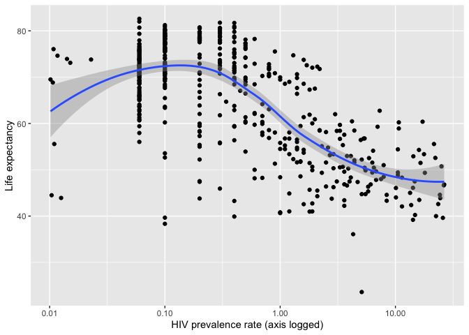
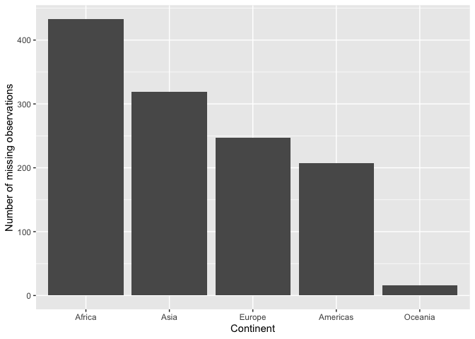

Joining Gapminder Data
================
Benjamin Soltoff

# Get the original data

``` r
library(tidyverse)
library(gapminder)

theme_set(theme_minimal())
gapminder
```

    ## # A tibble: 1,704 x 6
    ##    country     continent  year lifeExp      pop gdpPercap
    ##    <fct>       <fct>     <int>   <dbl>    <int>     <dbl>
    ##  1 Afghanistan Asia       1952    28.8  8425333      779.
    ##  2 Afghanistan Asia       1957    30.3  9240934      821.
    ##  3 Afghanistan Asia       1962    32.0 10267083      853.
    ##  4 Afghanistan Asia       1967    34.0 11537966      836.
    ##  5 Afghanistan Asia       1972    36.1 13079460      740.
    ##  6 Afghanistan Asia       1977    38.4 14880372      786.
    ##  7 Afghanistan Asia       1982    39.9 12881816      978.
    ##  8 Afghanistan Asia       1987    40.8 13867957      852.
    ##  9 Afghanistan Asia       1992    41.7 16317921      649.
    ## 10 Afghanistan Asia       1997    41.8 22227415      635.
    ## # … with 1,694 more rows

# Import the HIV data

    ## # A tibble: 3,301 x 3
    ##    country                   year hivRate
    ##    <chr>                    <dbl>   <dbl>
    ##  1 Angola                    1979  0.0265
    ##  2 Argentina                 1979  0.0205
    ##  3 Bahamas                   1979  0.01  
    ##  4 Barbados                  1979  0.0277
    ##  5 Botswana                  1979  0.106 
    ##  6 Brazil                    1979  0.0945
    ##  7 Burkina Faso              1979  0.01  
    ##  8 Burundi                   1979  0.0159
    ##  9 Canada                    1979  0.0130
    ## 10 Central African Republic  1979  0.113 
    ## # … with 3,291 more rows

# What is the relationship between HIV prevalence and life expectancy?

<!-- -->

# Which continents have the most observations with missing HIV data?

<!-- -->

## Session info

``` r
devtools::session_info()
```

    ## ─ Session info ──────────────────────────────────────────────────────────
    ##  setting  value                       
    ##  version  R version 3.5.3 (2019-03-11)
    ##  os       macOS Mojave 10.14.3        
    ##  system   x86_64, darwin15.6.0        
    ##  ui       X11                         
    ##  language (EN)                        
    ##  collate  en_US.UTF-8                 
    ##  ctype    en_US.UTF-8                 
    ##  tz       America/Chicago             
    ##  date     2019-04-25                  
    ## 
    ## ─ Packages ──────────────────────────────────────────────────────────────
    ##  package     * version date       lib source        
    ##  assertthat    0.2.1   2019-03-21 [2] CRAN (R 3.5.3)
    ##  backports     1.1.3   2018-12-14 [2] CRAN (R 3.5.0)
    ##  broom         0.5.1   2018-12-05 [2] CRAN (R 3.5.0)
    ##  callr         3.2.0   2019-03-15 [2] CRAN (R 3.5.2)
    ##  cellranger    1.1.0   2016-07-27 [2] CRAN (R 3.5.0)
    ##  cli           1.1.0   2019-03-19 [1] CRAN (R 3.5.2)
    ##  codetools     0.2-16  2018-12-24 [2] CRAN (R 3.5.3)
    ##  colorspace    1.4-1   2019-03-18 [2] CRAN (R 3.5.2)
    ##  crayon        1.3.4   2017-09-16 [2] CRAN (R 3.5.0)
    ##  desc          1.2.0   2018-05-01 [2] CRAN (R 3.5.0)
    ##  devtools      2.0.1   2018-10-26 [1] CRAN (R 3.5.1)
    ##  digest        0.6.18  2018-10-10 [1] CRAN (R 3.5.0)
    ##  dplyr       * 0.8.0.1 2019-02-15 [1] CRAN (R 3.5.2)
    ##  evaluate      0.13    2019-02-12 [2] CRAN (R 3.5.2)
    ##  fansi         0.4.0   2018-10-05 [2] CRAN (R 3.5.0)
    ##  forcats     * 0.4.0   2019-02-17 [2] CRAN (R 3.5.2)
    ##  fs            1.2.7   2019-03-19 [1] CRAN (R 3.5.3)
    ##  gapminder   * 0.3.0   2017-10-31 [1] CRAN (R 3.5.0)
    ##  generics      0.0.2   2018-11-29 [1] CRAN (R 3.5.0)
    ##  ggplot2     * 3.1.0   2018-10-25 [1] CRAN (R 3.5.0)
    ##  glue          1.3.1   2019-03-12 [2] CRAN (R 3.5.2)
    ##  gtable        0.2.0   2016-02-26 [2] CRAN (R 3.5.0)
    ##  haven         2.1.0   2019-02-19 [2] CRAN (R 3.5.2)
    ##  hms           0.4.2   2018-03-10 [2] CRAN (R 3.5.0)
    ##  htmltools     0.3.6   2017-04-28 [1] CRAN (R 3.5.0)
    ##  httr          1.4.0   2018-12-11 [2] CRAN (R 3.5.0)
    ##  jsonlite      1.6     2018-12-07 [2] CRAN (R 3.5.0)
    ##  knitr         1.22    2019-03-08 [2] CRAN (R 3.5.2)
    ##  labeling      0.3     2014-08-23 [2] CRAN (R 3.5.0)
    ##  lattice       0.20-38 2018-11-04 [2] CRAN (R 3.5.3)
    ##  lazyeval      0.2.2   2019-03-15 [2] CRAN (R 3.5.2)
    ##  lubridate     1.7.4   2018-04-11 [2] CRAN (R 3.5.0)
    ##  magrittr      1.5     2014-11-22 [2] CRAN (R 3.5.0)
    ##  memoise       1.1.0   2017-04-21 [2] CRAN (R 3.5.0)
    ##  modelr        0.1.4   2019-02-18 [2] CRAN (R 3.5.2)
    ##  munsell       0.5.0   2018-06-12 [2] CRAN (R 3.5.0)
    ##  nlme          3.1-137 2018-04-07 [2] CRAN (R 3.5.3)
    ##  pillar        1.3.1   2018-12-15 [2] CRAN (R 3.5.0)
    ##  pkgbuild      1.0.3   2019-03-20 [1] CRAN (R 3.5.3)
    ##  pkgconfig     2.0.2   2018-08-16 [2] CRAN (R 3.5.1)
    ##  pkgload       1.0.2   2018-10-29 [1] CRAN (R 3.5.0)
    ##  plyr          1.8.4   2016-06-08 [2] CRAN (R 3.5.0)
    ##  prettyunits   1.0.2   2015-07-13 [2] CRAN (R 3.5.0)
    ##  processx      3.3.0   2019-03-10 [2] CRAN (R 3.5.2)
    ##  ps            1.3.0   2018-12-21 [2] CRAN (R 3.5.0)
    ##  purrr       * 0.3.2   2019-03-15 [2] CRAN (R 3.5.2)
    ##  R6            2.4.0   2019-02-14 [1] CRAN (R 3.5.2)
    ##  Rcpp          1.0.1   2019-03-17 [1] CRAN (R 3.5.2)
    ##  readr       * 1.3.1   2018-12-21 [2] CRAN (R 3.5.0)
    ##  readxl        1.3.1   2019-03-13 [2] CRAN (R 3.5.2)
    ##  remotes       2.0.2   2018-10-30 [1] CRAN (R 3.5.0)
    ##  rlang         0.3.2   2019-03-21 [1] CRAN (R 3.5.3)
    ##  rmarkdown     1.12    2019-03-14 [1] CRAN (R 3.5.2)
    ##  rprojroot     1.3-2   2018-01-03 [2] CRAN (R 3.5.0)
    ##  rstudioapi    0.10    2019-03-19 [1] CRAN (R 3.5.3)
    ##  rvest         0.3.2   2016-06-17 [2] CRAN (R 3.5.0)
    ##  scales        1.0.0   2018-08-09 [1] CRAN (R 3.5.0)
    ##  sessioninfo   1.1.1   2018-11-05 [1] CRAN (R 3.5.0)
    ##  stringi       1.4.3   2019-03-12 [1] CRAN (R 3.5.2)
    ##  stringr     * 1.4.0   2019-02-10 [1] CRAN (R 3.5.2)
    ##  testthat      2.0.1   2018-10-13 [2] CRAN (R 3.5.0)
    ##  tibble      * 2.1.1   2019-03-16 [2] CRAN (R 3.5.2)
    ##  tidyr       * 0.8.3   2019-03-01 [1] CRAN (R 3.5.2)
    ##  tidyselect    0.2.5   2018-10-11 [1] CRAN (R 3.5.0)
    ##  tidyverse   * 1.2.1   2017-11-14 [2] CRAN (R 3.5.0)
    ##  usethis       1.4.0   2018-08-14 [1] CRAN (R 3.5.0)
    ##  utf8          1.1.4   2018-05-24 [2] CRAN (R 3.5.0)
    ##  withr         2.1.2   2018-03-15 [2] CRAN (R 3.5.0)
    ##  xfun          0.5     2019-02-20 [1] CRAN (R 3.5.2)
    ##  xml2          1.2.0   2018-01-24 [2] CRAN (R 3.5.0)
    ##  yaml          2.2.0   2018-07-25 [2] CRAN (R 3.5.0)
    ## 
    ## [1] /Users/soltoffbc/Library/R/3.5/library
    ## [2] /Library/Frameworks/R.framework/Versions/3.5/Resources/library
