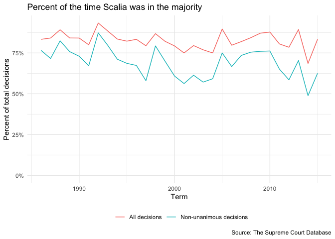
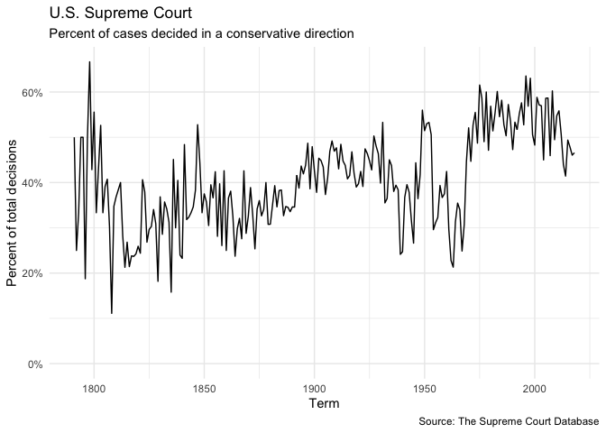
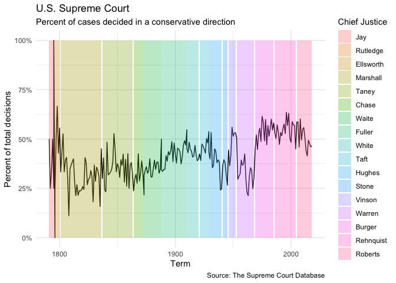

Exploring U.S. Supreme Court Decisions
================
Benjamin Soltoff

## Get the data

``` r
# load useful packages
library(tidyverse)

# set default theme
theme_set(theme_minimal())
```

``` r
scdbv_mod
```

    ## # A tibble: 80,269 x 61
    ##    caseId docketId caseIssuesId voteId dateDecision decisionType usCite
    ##    <chr>  <chr>    <chr>        <chr>  <chr>               <dbl> <chr> 
    ##  1 1946-… 1946-00… 1946-001-01… 1946-… 11/18/1946              1 329 U…
    ##  2 1946-… 1946-00… 1946-001-01… 1946-… 11/18/1946              1 329 U…
    ##  3 1946-… 1946-00… 1946-001-01… 1946-… 11/18/1946              1 329 U…
    ##  4 1946-… 1946-00… 1946-001-01… 1946-… 11/18/1946              1 329 U…
    ##  5 1946-… 1946-00… 1946-001-01… 1946-… 11/18/1946              1 329 U…
    ##  6 1946-… 1946-00… 1946-001-01… 1946-… 11/18/1946              1 329 U…
    ##  7 1946-… 1946-00… 1946-001-01… 1946-… 11/18/1946              1 329 U…
    ##  8 1946-… 1946-00… 1946-001-01… 1946-… 11/18/1946              1 329 U…
    ##  9 1946-… 1946-00… 1946-001-01… 1946-… 11/18/1946              1 329 U…
    ## 10 1946-… 1946-00… 1946-002-01… 1946-… 11/18/1946              1 329 U…
    ## # … with 80,259 more rows, and 54 more variables: sctCite <chr>,
    ## #   ledCite <chr>, lexisCite <chr>, term <dbl>, naturalCourt <dbl>,
    ## #   chief <chr>, docket <chr>, caseName <chr>, dateArgument <chr>,
    ## #   dateRearg <chr>, petitioner <dbl>, petitionerState <dbl>,
    ## #   respondent <dbl>, respondentState <dbl>, jurisdiction <dbl>,
    ## #   adminAction <dbl>, adminActionState <dbl>, threeJudgeFdc <dbl>,
    ## #   caseOrigin <dbl>, caseOriginState <dbl>, caseSource <dbl>,
    ## #   caseSourceState <dbl>, lcDisagreement <dbl>, certReason <dbl>,
    ## #   lcDisposition <dbl>, lcDispositionDirection <dbl>,
    ## #   declarationUncon <dbl>, caseDisposition <dbl>,
    ## #   caseDispositionUnusual <dbl>, partyWinning <dbl>,
    ## #   precedentAlteration <dbl>, voteUnclear <dbl>, issue <dbl>,
    ## #   issueArea <dbl>, decisionDirection <dbl>,
    ## #   decisionDirectionDissent <dbl>, authorityDecision1 <dbl>,
    ## #   authorityDecision2 <dbl>, lawType <dbl>, lawSupp <dbl>,
    ## #   lawMinor <chr>, majOpinWriter <dbl>, majOpinAssigner <dbl>,
    ## #   splitVote <dbl>, majVotes <dbl>, minVotes <dbl>, justice <dbl>,
    ## #   justiceName <chr>, vote <dbl>, opinion <dbl>, direction <dbl>,
    ## #   majority <dbl>, firstAgreement <dbl>, secondAgreement <dbl>

``` r
scdbv_leg
```

    ## # A tibble: 172,213 x 61
    ##    caseId docketId caseIssuesId voteId dateDecision decisionType usCite
    ##    <chr>  <chr>    <chr>        <chr>  <chr>               <dbl> <chr> 
    ##  1 1791-… 1791-00… 1791-001-01… 1791-… 8/3/1791                6 2 U.S…
    ##  2 1791-… 1791-00… 1791-001-01… 1791-… 8/3/1791                6 2 U.S…
    ##  3 1791-… 1791-00… 1791-001-01… 1791-… 8/3/1791                6 2 U.S…
    ##  4 1791-… 1791-00… 1791-001-01… 1791-… 8/3/1791                6 2 U.S…
    ##  5 1791-… 1791-00… 1791-001-01… 1791-… 8/3/1791                6 2 U.S…
    ##  6 1791-… 1791-00… 1791-002-01… 1791-… 8/3/1791                2 2 U.S…
    ##  7 1791-… 1791-00… 1791-002-01… 1791-… 8/3/1791                2 2 U.S…
    ##  8 1791-… 1791-00… 1791-002-01… 1791-… 8/3/1791                2 2 U.S…
    ##  9 1791-… 1791-00… 1791-002-01… 1791-… 8/3/1791                2 2 U.S…
    ## 10 1791-… 1791-00… 1791-002-01… 1791-… 8/3/1791                2 2 U.S…
    ## # … with 172,203 more rows, and 54 more variables: sctCite <lgl>,
    ## #   ledCite <chr>, lexisCite <chr>, term <dbl>, naturalCourt <dbl>,
    ## #   chief <chr>, docket <chr>, caseName <chr>, dateArgument <chr>,
    ## #   dateRearg <chr>, petitioner <dbl>, petitionerState <dbl>,
    ## #   respondent <dbl>, respondentState <dbl>, jurisdiction <dbl>,
    ## #   adminAction <dbl>, adminActionState <dbl>, threeJudgeFdc <dbl>,
    ## #   caseOrigin <dbl>, caseOriginState <dbl>, caseSource <dbl>,
    ## #   caseSourceState <dbl>, lcDisagreement <dbl>, certReason <dbl>,
    ## #   lcDisposition <dbl>, lcDispositionDirection <dbl>,
    ## #   declarationUncon <dbl>, caseDisposition <dbl>,
    ## #   caseDispositionUnusual <dbl>, partyWinning <dbl>,
    ## #   precedentAlteration <dbl>, voteUnclear <dbl>, issue <dbl>,
    ## #   issueArea <dbl>, decisionDirection <dbl>,
    ## #   decisionDirectionDissent <dbl>, authorityDecision1 <dbl>,
    ## #   authorityDecision2 <dbl>, lawType <dbl>, lawSupp <dbl>,
    ## #   lawMinor <chr>, majOpinWriter <dbl>, majOpinAssigner <dbl>,
    ## #   splitVote <dbl>, majVotes <dbl>, minVotes <dbl>, justice <dbl>,
    ## #   justiceName <chr>, vote <dbl>, opinion <dbl>, direction <dbl>,
    ## #   majority <dbl>, firstAgreement <dbl>, secondAgreement <dbl>

## Combine the datasets

    ## # A tibble: 252,482 x 61
    ##    caseId docketId caseIssuesId voteId dateDecision decisionType usCite
    ##    <chr>  <chr>    <chr>        <chr>  <chr>               <dbl> <chr> 
    ##  1 1946-… 1946-00… 1946-001-01… 1946-… 11/18/1946              1 329 U…
    ##  2 1946-… 1946-00… 1946-001-01… 1946-… 11/18/1946              1 329 U…
    ##  3 1946-… 1946-00… 1946-001-01… 1946-… 11/18/1946              1 329 U…
    ##  4 1946-… 1946-00… 1946-001-01… 1946-… 11/18/1946              1 329 U…
    ##  5 1946-… 1946-00… 1946-001-01… 1946-… 11/18/1946              1 329 U…
    ##  6 1946-… 1946-00… 1946-001-01… 1946-… 11/18/1946              1 329 U…
    ##  7 1946-… 1946-00… 1946-001-01… 1946-… 11/18/1946              1 329 U…
    ##  8 1946-… 1946-00… 1946-001-01… 1946-… 11/18/1946              1 329 U…
    ##  9 1946-… 1946-00… 1946-001-01… 1946-… 11/18/1946              1 329 U…
    ## 10 1946-… 1946-00… 1946-002-01… 1946-… 11/18/1946              1 329 U…
    ## # … with 252,472 more rows, and 54 more variables: sctCite <chr>,
    ## #   ledCite <chr>, lexisCite <chr>, term <dbl>, naturalCourt <dbl>,
    ## #   chief <chr>, docket <chr>, caseName <chr>, dateArgument <chr>,
    ## #   dateRearg <chr>, petitioner <dbl>, petitionerState <dbl>,
    ## #   respondent <dbl>, respondentState <dbl>, jurisdiction <dbl>,
    ## #   adminAction <dbl>, adminActionState <dbl>, threeJudgeFdc <dbl>,
    ## #   caseOrigin <dbl>, caseOriginState <dbl>, caseSource <dbl>,
    ## #   caseSourceState <dbl>, lcDisagreement <dbl>, certReason <dbl>,
    ## #   lcDisposition <dbl>, lcDispositionDirection <dbl>,
    ## #   declarationUncon <dbl>, caseDisposition <dbl>,
    ## #   caseDispositionUnusual <dbl>, partyWinning <dbl>,
    ## #   precedentAlteration <dbl>, voteUnclear <dbl>, issue <dbl>,
    ## #   issueArea <dbl>, decisionDirection <dbl>,
    ## #   decisionDirectionDissent <dbl>, authorityDecision1 <dbl>,
    ## #   authorityDecision2 <dbl>, lawType <dbl>, lawSupp <dbl>,
    ## #   lawMinor <chr>, majOpinWriter <dbl>, majOpinAssigner <dbl>,
    ## #   splitVote <dbl>, majVotes <dbl>, minVotes <dbl>, justice <dbl>,
    ## #   justiceName <chr>, vote <dbl>, opinion <dbl>, direction <dbl>,
    ## #   majority <dbl>, firstAgreement <dbl>, secondAgreement <dbl>

## Recode variables as you find necessary

## What percentage of cases in each term are decided by a one-vote margin (i.e. 5-4, 4-3, etc.)

<!-- -->

## In each term he served on the Court, in what percentage of cases was Justice Antonin Scalia in the majority?

<!-- -->

## Create a graph similar to above that adds a second component which compares the percentage for all cases versus non-unanimous cases (i.e. there was at least one dissenting vote)

### With two data frames

<!-- -->

### With a single data frame

<!-- -->

## In each term, what percentage of cases were decided in the conservative direction?

<!-- -->

## The Chief Justice is frequently seen as capable of influencing the ideological direction of the Court. Create a graph similar to the one above that also incorporates information on who was the Chief Justice during the term.

#### Solution using facets (not too much more difficult)

<!-- -->

#### Solution using facets and showing whole data on each facet (getting harder)

<!-- -->

#### Solution shading original graph with color-coded eras of Chief Justices (attempt at your own risk)

<!-- -->

## In each term, how many of the term’s published decisions (decided after oral arguments) were announced in a given month?

<!-- -->

## Session info

``` r
devtools::session_info()
```

    ## ─ Session info ──────────────────────────────────────────────────────────
    ##  setting  value                       
    ##  version  R version 3.5.3 (2019-03-11)
    ##  os       macOS Mojave 10.14.3        
    ##  system   x86_64, darwin15.6.0        
    ##  ui       X11                         
    ##  language (EN)                        
    ##  collate  en_US.UTF-8                 
    ##  ctype    en_US.UTF-8                 
    ##  tz       America/Chicago             
    ##  date     2019-04-25                  
    ## 
    ## ─ Packages ──────────────────────────────────────────────────────────────
    ##  package     * version date       lib source        
    ##  assertthat    0.2.1   2019-03-21 [2] CRAN (R 3.5.3)
    ##  backports     1.1.3   2018-12-14 [2] CRAN (R 3.5.0)
    ##  broom         0.5.1   2018-12-05 [2] CRAN (R 3.5.0)
    ##  callr         3.2.0   2019-03-15 [2] CRAN (R 3.5.2)
    ##  cellranger    1.1.0   2016-07-27 [2] CRAN (R 3.5.0)
    ##  cli           1.1.0   2019-03-19 [1] CRAN (R 3.5.2)
    ##  codetools     0.2-16  2018-12-24 [2] CRAN (R 3.5.3)
    ##  colorspace    1.4-1   2019-03-18 [2] CRAN (R 3.5.2)
    ##  crayon        1.3.4   2017-09-16 [2] CRAN (R 3.5.0)
    ##  desc          1.2.0   2018-05-01 [2] CRAN (R 3.5.0)
    ##  devtools      2.0.1   2018-10-26 [1] CRAN (R 3.5.1)
    ##  digest        0.6.18  2018-10-10 [1] CRAN (R 3.5.0)
    ##  dplyr       * 0.8.0.1 2019-02-15 [1] CRAN (R 3.5.2)
    ##  ellipsis      0.1.0   2019-02-19 [2] CRAN (R 3.5.2)
    ##  evaluate      0.13    2019-02-12 [2] CRAN (R 3.5.2)
    ##  fansi         0.4.0   2018-10-05 [2] CRAN (R 3.5.0)
    ##  forcats     * 0.4.0   2019-02-17 [2] CRAN (R 3.5.2)
    ##  fs            1.2.7   2019-03-19 [1] CRAN (R 3.5.3)
    ##  generics      0.0.2   2018-11-29 [1] CRAN (R 3.5.0)
    ##  ggplot2     * 3.1.0   2018-10-25 [1] CRAN (R 3.5.0)
    ##  glue          1.3.1   2019-03-12 [2] CRAN (R 3.5.2)
    ##  gtable        0.2.0   2016-02-26 [2] CRAN (R 3.5.0)
    ##  haven         2.1.0   2019-02-19 [2] CRAN (R 3.5.2)
    ##  hms           0.4.2   2018-03-10 [2] CRAN (R 3.5.0)
    ##  htmltools     0.3.6   2017-04-28 [1] CRAN (R 3.5.0)
    ##  httr          1.4.0   2018-12-11 [2] CRAN (R 3.5.0)
    ##  jsonlite      1.6     2018-12-07 [2] CRAN (R 3.5.0)
    ##  knitr         1.22    2019-03-08 [2] CRAN (R 3.5.2)
    ##  labeling      0.3     2014-08-23 [2] CRAN (R 3.5.0)
    ##  lattice       0.20-38 2018-11-04 [2] CRAN (R 3.5.3)
    ##  lazyeval      0.2.2   2019-03-15 [2] CRAN (R 3.5.2)
    ##  lubridate   * 1.7.4   2018-04-11 [2] CRAN (R 3.5.0)
    ##  magrittr      1.5     2014-11-22 [2] CRAN (R 3.5.0)
    ##  memoise       1.1.0   2017-04-21 [2] CRAN (R 3.5.0)
    ##  modelr        0.1.4   2019-02-18 [2] CRAN (R 3.5.2)
    ##  munsell       0.5.0   2018-06-12 [2] CRAN (R 3.5.0)
    ##  nlme          3.1-137 2018-04-07 [2] CRAN (R 3.5.3)
    ##  pillar        1.3.1   2018-12-15 [2] CRAN (R 3.5.0)
    ##  pkgbuild      1.0.3   2019-03-20 [1] CRAN (R 3.5.3)
    ##  pkgconfig     2.0.2   2018-08-16 [2] CRAN (R 3.5.1)
    ##  pkgload       1.0.2   2018-10-29 [1] CRAN (R 3.5.0)
    ##  plyr          1.8.4   2016-06-08 [2] CRAN (R 3.5.0)
    ##  prettyunits   1.0.2   2015-07-13 [2] CRAN (R 3.5.0)
    ##  processx      3.3.0   2019-03-10 [2] CRAN (R 3.5.2)
    ##  ps            1.3.0   2018-12-21 [2] CRAN (R 3.5.0)
    ##  purrr       * 0.3.2   2019-03-15 [2] CRAN (R 3.5.2)
    ##  R6            2.4.0   2019-02-14 [1] CRAN (R 3.5.2)
    ##  Rcpp          1.0.1   2019-03-17 [1] CRAN (R 3.5.2)
    ##  readr       * 1.3.1   2018-12-21 [2] CRAN (R 3.5.0)
    ##  readxl        1.3.1   2019-03-13 [2] CRAN (R 3.5.2)
    ##  remotes       2.0.2   2018-10-30 [1] CRAN (R 3.5.0)
    ##  rlang         0.3.2   2019-03-21 [1] CRAN (R 3.5.3)
    ##  rmarkdown     1.12    2019-03-14 [1] CRAN (R 3.5.2)
    ##  rprojroot     1.3-2   2018-01-03 [2] CRAN (R 3.5.0)
    ##  rstudioapi    0.10    2019-03-19 [1] CRAN (R 3.5.3)
    ##  rvest         0.3.2   2016-06-17 [2] CRAN (R 3.5.0)
    ##  scales        1.0.0   2018-08-09 [1] CRAN (R 3.5.0)
    ##  sessioninfo   1.1.1   2018-11-05 [1] CRAN (R 3.5.0)
    ##  stringi       1.4.3   2019-03-12 [1] CRAN (R 3.5.2)
    ##  stringr     * 1.4.0   2019-02-10 [1] CRAN (R 3.5.2)
    ##  testthat      2.0.1   2018-10-13 [2] CRAN (R 3.5.0)
    ##  tibble      * 2.1.1   2019-03-16 [2] CRAN (R 3.5.2)
    ##  tidyr       * 0.8.3   2019-03-01 [1] CRAN (R 3.5.2)
    ##  tidyselect    0.2.5   2018-10-11 [1] CRAN (R 3.5.0)
    ##  tidyverse   * 1.2.1   2017-11-14 [2] CRAN (R 3.5.0)
    ##  usethis       1.4.0   2018-08-14 [1] CRAN (R 3.5.0)
    ##  utf8          1.1.4   2018-05-24 [2] CRAN (R 3.5.0)
    ##  withr         2.1.2   2018-03-15 [2] CRAN (R 3.5.0)
    ##  xfun          0.5     2019-02-20 [1] CRAN (R 3.5.2)
    ##  xml2          1.2.0   2018-01-24 [2] CRAN (R 3.5.0)
    ##  yaml          2.2.0   2018-07-25 [2] CRAN (R 3.5.0)
    ## 
    ## [1] /Users/soltoffbc/Library/R/3.5/library
    ## [2] /Library/Frameworks/R.framework/Versions/3.5/Resources/library
