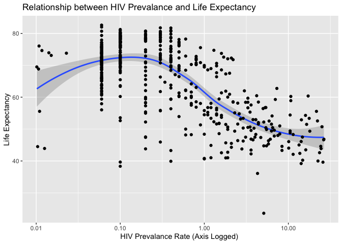
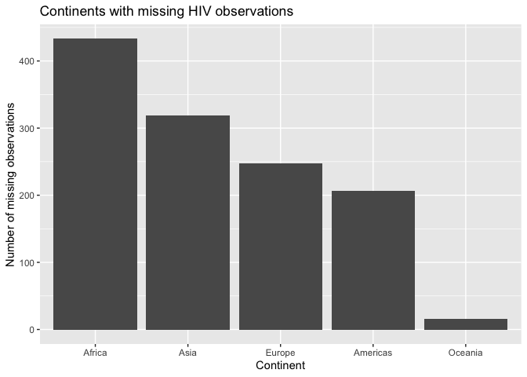

Joining Gapminder Data
================
Ojaswi Malik

# Get the original data

``` r
library(tidyverse)
```

    ## ── Attaching packages ────────────────────────────────────────────────────────────────────────────────── tidyverse 1.3.0 ──

    ## ✓ ggplot2 3.3.0     ✓ purrr   0.3.4
    ## ✓ tibble  3.0.0     ✓ dplyr   0.8.5
    ## ✓ tidyr   1.0.2     ✓ stringr 1.4.0
    ## ✓ readr   1.3.1     ✓ forcats 0.5.0

    ## ── Conflicts ───────────────────────────────────────────────────────────────────────────────────── tidyverse_conflicts() ──
    ## x dplyr::filter() masks stats::filter()
    ## x dplyr::lag()    masks stats::lag()

``` r
library(gapminder)

gapminder
```

    ## # A tibble: 1,704 x 6
    ##    country     continent  year lifeExp      pop gdpPercap
    ##    <fct>       <fct>     <int>   <dbl>    <int>     <dbl>
    ##  1 Afghanistan Asia       1952    28.8  8425333      779.
    ##  2 Afghanistan Asia       1957    30.3  9240934      821.
    ##  3 Afghanistan Asia       1962    32.0 10267083      853.
    ##  4 Afghanistan Asia       1967    34.0 11537966      836.
    ##  5 Afghanistan Asia       1972    36.1 13079460      740.
    ##  6 Afghanistan Asia       1977    38.4 14880372      786.
    ##  7 Afghanistan Asia       1982    39.9 12881816      978.
    ##  8 Afghanistan Asia       1987    40.8 13867957      852.
    ##  9 Afghanistan Asia       1992    41.7 16317921      649.
    ## 10 Afghanistan Asia       1997    41.8 22227415      635.
    ## # … with 1,694 more rows

# Import the HIV data

``` r
hiv_data <- read_csv("data/gapminder_hiv.csv")
```

    ## Parsed with column specification:
    ## cols(
    ##   country = col_character(),
    ##   year = col_double(),
    ##   hivRate = col_double()
    ## )

# What is the relationship between HIV prevalence and life expectancy?

**Inner Join used** because the number of the data objects are greater
in gapminder (X) than in hiv\_data (Y) and using inner join will return
all values in the X dataframe that have matching values in the Y
dataframe. This way all the NA values for hivRate for countries that are
present in gapminder and not in hiv\_data can be removed and we can
easily plot our graph.

``` r
gapminder %>%
  inner_join(y = hiv_data) %>%
  ggplot(mapping = aes(x = hivRate, y = lifeExp)) +
  geom_smooth() +
  geom_point() +
  scale_x_log10() + 
  labs(
    title = "Relationship between HIV Prevalance and Life Expectancy",
    x = "HIV Prevalance Rate (Axis Logged) ",
    y = "Life Expectancy"
  )
```

    ## Joining, by = c("country", "year")

    ## Warning: Column `country` joining factor and character vector, coercing into
    ## character vector

    ## `geom_smooth()` using method = 'loess' and formula 'y ~ x'

<!-- -->

# Which continents have the most observations with missing HIV data?

**Anti Join used** In order to narrow down those countries inside
continents in gapminder (x) that do not have a corresponding HIV value
in hiv\_data, it is best to use anti\_join. It is a filtering join which
will return all rows in X that do not have a match in Y, which is
exactly what we need.

``` r
gapminder %>%
  anti_join(y = hiv_data) %>%
  count(continent) %>%
  ggplot(mapping = aes(x = reorder(continent, -n), y = n)) + 
  geom_col() + 
  labs(
    title = "Continents with missing HIV observations",
    x = "Continent",
    y = "Number of missing observations"
  )
```

    ## Joining, by = c("country", "year")

    ## Warning: Column `country` joining factor and character vector, coercing into
    ## character vector

<!-- -->

## Session info

``` r
devtools::session_info()
```

    ## ─ Session info ───────────────────────────────────────────────────────────────
    ##  setting  value                       
    ##  version  R version 3.6.3 (2020-02-29)
    ##  os       macOS Catalina 10.15.4      
    ##  system   x86_64, darwin15.6.0        
    ##  ui       X11                         
    ##  language (EN)                        
    ##  collate  en_US.UTF-8                 
    ##  ctype    en_US.UTF-8                 
    ##  tz       Asia/Kolkata                
    ##  date     2020-04-26                  
    ## 
    ## ─ Packages ───────────────────────────────────────────────────────────────────
    ##  package     * version date       lib source        
    ##  assertthat    0.2.1   2019-03-21 [1] CRAN (R 3.6.0)
    ##  backports     1.1.6   2020-04-05 [1] CRAN (R 3.6.2)
    ##  broom         0.5.5   2020-02-29 [1] CRAN (R 3.6.0)
    ##  callr         3.4.3   2020-03-28 [1] CRAN (R 3.6.2)
    ##  cellranger    1.1.0   2016-07-27 [1] CRAN (R 3.6.0)
    ##  cli           2.0.2   2020-02-28 [1] CRAN (R 3.6.0)
    ##  colorspace    1.4-1   2019-03-18 [1] CRAN (R 3.6.0)
    ##  crayon        1.3.4   2017-09-16 [1] CRAN (R 3.6.0)
    ##  DBI           1.1.0   2019-12-15 [1] CRAN (R 3.6.0)
    ##  dbplyr        1.4.3   2020-04-19 [1] CRAN (R 3.6.3)
    ##  desc          1.2.0   2018-05-01 [1] CRAN (R 3.6.0)
    ##  devtools      2.3.0   2020-04-10 [1] CRAN (R 3.6.3)
    ##  digest        0.6.25  2020-02-23 [1] CRAN (R 3.6.0)
    ##  dplyr       * 0.8.5   2020-03-07 [1] CRAN (R 3.6.0)
    ##  ellipsis      0.3.0   2019-09-20 [1] CRAN (R 3.6.0)
    ##  evaluate      0.14    2019-05-28 [1] CRAN (R 3.6.0)
    ##  fansi         0.4.1   2020-01-08 [1] CRAN (R 3.6.0)
    ##  farver        2.0.3   2020-01-16 [1] CRAN (R 3.6.0)
    ##  forcats     * 0.5.0   2020-03-01 [1] CRAN (R 3.6.0)
    ##  fs            1.4.1   2020-04-04 [1] CRAN (R 3.6.2)
    ##  gapminder   * 0.3.0   2017-10-31 [1] CRAN (R 3.6.0)
    ##  generics      0.0.2   2018-11-29 [1] CRAN (R 3.6.0)
    ##  ggplot2     * 3.3.0   2020-03-05 [1] CRAN (R 3.6.0)
    ##  glue          1.4.0   2020-04-03 [1] CRAN (R 3.6.2)
    ##  gtable        0.3.0   2019-03-25 [1] CRAN (R 3.6.0)
    ##  haven         2.2.0   2019-11-08 [1] CRAN (R 3.6.0)
    ##  hms           0.5.3   2020-01-08 [1] CRAN (R 3.6.0)
    ##  htmltools     0.4.0   2019-10-04 [1] CRAN (R 3.6.0)
    ##  httr          1.4.1   2019-08-05 [1] CRAN (R 3.6.0)
    ##  jsonlite      1.6.1   2020-02-02 [1] CRAN (R 3.6.0)
    ##  knitr         1.28    2020-02-06 [1] CRAN (R 3.6.0)
    ##  labeling      0.3     2014-08-23 [1] CRAN (R 3.6.0)
    ##  lattice       0.20-38 2018-11-04 [1] CRAN (R 3.6.3)
    ##  lifecycle     0.2.0   2020-03-06 [1] CRAN (R 3.6.0)
    ##  lubridate     1.7.8   2020-04-06 [1] CRAN (R 3.6.2)
    ##  magrittr      1.5     2014-11-22 [1] CRAN (R 3.6.0)
    ##  Matrix        1.2-18  2019-11-27 [1] CRAN (R 3.6.3)
    ##  memoise       1.1.0   2017-04-21 [1] CRAN (R 3.6.0)
    ##  mgcv          1.8-31  2019-11-09 [1] CRAN (R 3.6.3)
    ##  modelr        0.1.6   2020-02-22 [1] CRAN (R 3.6.0)
    ##  munsell       0.5.0   2018-06-12 [1] CRAN (R 3.6.0)
    ##  nlme          3.1-144 2020-02-06 [1] CRAN (R 3.6.3)
    ##  pillar        1.4.3   2019-12-20 [1] CRAN (R 3.6.0)
    ##  pkgbuild      1.0.6   2019-10-09 [1] CRAN (R 3.6.0)
    ##  pkgconfig     2.0.3   2019-09-22 [1] CRAN (R 3.6.0)
    ##  pkgload       1.0.2   2018-10-29 [1] CRAN (R 3.6.0)
    ##  prettyunits   1.1.1   2020-01-24 [1] CRAN (R 3.6.0)
    ##  processx      3.4.2   2020-02-09 [1] CRAN (R 3.6.0)
    ##  ps            1.3.2   2020-02-13 [1] CRAN (R 3.6.0)
    ##  purrr       * 0.3.4   2020-04-17 [1] CRAN (R 3.6.2)
    ##  R6            2.4.1   2019-11-12 [1] CRAN (R 3.6.0)
    ##  Rcpp          1.0.4.6 2020-04-09 [1] CRAN (R 3.6.3)
    ##  readr       * 1.3.1   2018-12-21 [1] CRAN (R 3.6.0)
    ##  readxl        1.3.1   2019-03-13 [1] CRAN (R 3.6.0)
    ##  remotes       2.1.1   2020-02-15 [1] CRAN (R 3.6.0)
    ##  reprex        0.3.0   2019-05-16 [1] CRAN (R 3.6.0)
    ##  rlang         0.4.5   2020-03-01 [1] CRAN (R 3.6.0)
    ##  rmarkdown     2.1     2020-01-20 [1] CRAN (R 3.6.0)
    ##  rprojroot     1.3-2   2018-01-03 [1] CRAN (R 3.6.0)
    ##  rstudioapi    0.11    2020-02-07 [1] CRAN (R 3.6.0)
    ##  rvest         0.3.5   2019-11-08 [1] CRAN (R 3.6.0)
    ##  scales        1.1.0   2019-11-18 [1] CRAN (R 3.6.0)
    ##  sessioninfo   1.1.1   2018-11-05 [1] CRAN (R 3.6.0)
    ##  stringi       1.4.6   2020-02-17 [1] CRAN (R 3.6.0)
    ##  stringr     * 1.4.0   2019-02-10 [1] CRAN (R 3.6.0)
    ##  testthat      2.3.2   2020-03-02 [1] CRAN (R 3.6.0)
    ##  tibble      * 3.0.0   2020-03-30 [1] CRAN (R 3.6.2)
    ##  tidyr       * 1.0.2   2020-01-24 [1] CRAN (R 3.6.0)
    ##  tidyselect    1.0.0   2020-01-27 [1] CRAN (R 3.6.0)
    ##  tidyverse   * 1.3.0   2019-11-21 [1] CRAN (R 3.6.0)
    ##  usethis       1.6.0   2020-04-09 [1] CRAN (R 3.6.3)
    ##  utf8          1.1.4   2018-05-24 [1] CRAN (R 3.6.0)
    ##  vctrs         0.2.4   2020-03-10 [1] CRAN (R 3.6.0)
    ##  withr         2.1.2   2018-03-15 [1] CRAN (R 3.6.0)
    ##  xfun          0.13    2020-04-13 [1] CRAN (R 3.6.2)
    ##  xml2          1.3.1   2020-04-09 [1] CRAN (R 3.6.2)
    ##  yaml          2.2.1   2020-02-01 [1] CRAN (R 3.6.0)
    ## 
    ## [1] /Library/Frameworks/R.framework/Versions/3.6/Resources/library
