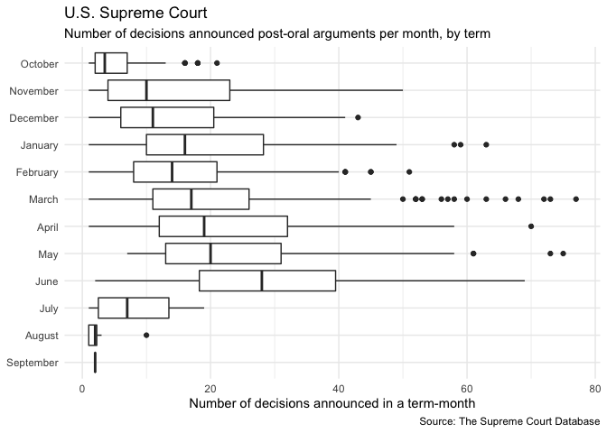

Exploring U.S. Supreme Court Decisions
================
Ojaswi Malik

## Get the data

``` r
# load useful packages
library(tidyverse)
```

    ## ── Attaching packages ─────────────────────────────────────────────────────────────────────────────── tidyverse 1.3.0 ──

    ## ✓ ggplot2 3.3.0     ✓ purrr   0.3.4
    ## ✓ tibble  3.0.0     ✓ dplyr   0.8.5
    ## ✓ tidyr   1.0.2     ✓ stringr 1.4.0
    ## ✓ readr   1.3.1     ✓ forcats 0.5.0

    ## ── Conflicts ────────────────────────────────────────────────────────────────────────────────── tidyverse_conflicts() ──
    ## x dplyr::filter() masks stats::filter()
    ## x dplyr::lag()    masks stats::lag()

``` r
theme_set(theme_minimal()) 

# load data
scdbv_mod <- read_csv("data/SCDB_2019_01_justiceCentered_Citation.csv", col_types = 
                        cols(
                          docket = col_character()
                        ))

scdbv_leg <- read_csv("data/SCDB_Legacy_05_justiceCentered_Citation.csv", col_types = 
                        cols(
                          docket = col_character(),
                          adminAction = col_double(),
                          adminActionState = col_double(),
                          sctCite = col_character()
                        ))
scdbv_mod
```

    ## # A tibble: 80,269 x 61
    ##    caseId docketId caseIssuesId voteId dateDecision decisionType usCite sctCite
    ##    <chr>  <chr>    <chr>        <chr>  <chr>               <dbl> <chr>  <chr>  
    ##  1 1946-… 1946-00… 1946-001-01… 1946-… 11/18/1946              1 329 U… 67 S. …
    ##  2 1946-… 1946-00… 1946-001-01… 1946-… 11/18/1946              1 329 U… 67 S. …
    ##  3 1946-… 1946-00… 1946-001-01… 1946-… 11/18/1946              1 329 U… 67 S. …
    ##  4 1946-… 1946-00… 1946-001-01… 1946-… 11/18/1946              1 329 U… 67 S. …
    ##  5 1946-… 1946-00… 1946-001-01… 1946-… 11/18/1946              1 329 U… 67 S. …
    ##  6 1946-… 1946-00… 1946-001-01… 1946-… 11/18/1946              1 329 U… 67 S. …
    ##  7 1946-… 1946-00… 1946-001-01… 1946-… 11/18/1946              1 329 U… 67 S. …
    ##  8 1946-… 1946-00… 1946-001-01… 1946-… 11/18/1946              1 329 U… 67 S. …
    ##  9 1946-… 1946-00… 1946-001-01… 1946-… 11/18/1946              1 329 U… 67 S. …
    ## 10 1946-… 1946-00… 1946-002-01… 1946-… 11/18/1946              1 329 U… 67 S. …
    ## # … with 80,259 more rows, and 53 more variables: ledCite <chr>,
    ## #   lexisCite <chr>, term <dbl>, naturalCourt <dbl>, chief <chr>, docket <chr>,
    ## #   caseName <chr>, dateArgument <chr>, dateRearg <chr>, petitioner <dbl>,
    ## #   petitionerState <dbl>, respondent <dbl>, respondentState <dbl>,
    ## #   jurisdiction <dbl>, adminAction <dbl>, adminActionState <dbl>,
    ## #   threeJudgeFdc <dbl>, caseOrigin <dbl>, caseOriginState <dbl>,
    ## #   caseSource <dbl>, caseSourceState <dbl>, lcDisagreement <dbl>,
    ## #   certReason <dbl>, lcDisposition <dbl>, lcDispositionDirection <dbl>,
    ## #   declarationUncon <dbl>, caseDisposition <dbl>,
    ## #   caseDispositionUnusual <dbl>, partyWinning <dbl>,
    ## #   precedentAlteration <dbl>, voteUnclear <dbl>, issue <dbl>, issueArea <dbl>,
    ## #   decisionDirection <dbl>, decisionDirectionDissent <dbl>,
    ## #   authorityDecision1 <dbl>, authorityDecision2 <dbl>, lawType <dbl>,
    ## #   lawSupp <dbl>, lawMinor <chr>, majOpinWriter <dbl>, majOpinAssigner <dbl>,
    ## #   splitVote <dbl>, majVotes <dbl>, minVotes <dbl>, justice <dbl>,
    ## #   justiceName <chr>, vote <dbl>, opinion <dbl>, direction <dbl>,
    ## #   majority <dbl>, firstAgreement <dbl>, secondAgreement <dbl>

``` r
scdbv_leg
```

    ## # A tibble: 172,213 x 61
    ##    caseId docketId caseIssuesId voteId dateDecision decisionType usCite sctCite
    ##    <chr>  <chr>    <chr>        <chr>  <chr>               <dbl> <chr>  <chr>  
    ##  1 1791-… 1791-00… 1791-001-01… 1791-… 8/3/1791                6 2 U.S… <NA>   
    ##  2 1791-… 1791-00… 1791-001-01… 1791-… 8/3/1791                6 2 U.S… <NA>   
    ##  3 1791-… 1791-00… 1791-001-01… 1791-… 8/3/1791                6 2 U.S… <NA>   
    ##  4 1791-… 1791-00… 1791-001-01… 1791-… 8/3/1791                6 2 U.S… <NA>   
    ##  5 1791-… 1791-00… 1791-001-01… 1791-… 8/3/1791                6 2 U.S… <NA>   
    ##  6 1791-… 1791-00… 1791-002-01… 1791-… 8/3/1791                2 2 U.S… <NA>   
    ##  7 1791-… 1791-00… 1791-002-01… 1791-… 8/3/1791                2 2 U.S… <NA>   
    ##  8 1791-… 1791-00… 1791-002-01… 1791-… 8/3/1791                2 2 U.S… <NA>   
    ##  9 1791-… 1791-00… 1791-002-01… 1791-… 8/3/1791                2 2 U.S… <NA>   
    ## 10 1791-… 1791-00… 1791-002-01… 1791-… 8/3/1791                2 2 U.S… <NA>   
    ## # … with 172,203 more rows, and 53 more variables: ledCite <chr>,
    ## #   lexisCite <chr>, term <dbl>, naturalCourt <dbl>, chief <chr>, docket <chr>,
    ## #   caseName <chr>, dateArgument <chr>, dateRearg <chr>, petitioner <dbl>,
    ## #   petitionerState <dbl>, respondent <dbl>, respondentState <dbl>,
    ## #   jurisdiction <dbl>, adminAction <dbl>, adminActionState <dbl>,
    ## #   threeJudgeFdc <dbl>, caseOrigin <dbl>, caseOriginState <dbl>,
    ## #   caseSource <dbl>, caseSourceState <dbl>, lcDisagreement <dbl>,
    ## #   certReason <dbl>, lcDisposition <dbl>, lcDispositionDirection <dbl>,
    ## #   declarationUncon <dbl>, caseDisposition <dbl>,
    ## #   caseDispositionUnusual <dbl>, partyWinning <dbl>,
    ## #   precedentAlteration <dbl>, voteUnclear <dbl>, issue <dbl>, issueArea <dbl>,
    ## #   decisionDirection <dbl>, decisionDirectionDissent <dbl>,
    ## #   authorityDecision1 <dbl>, authorityDecision2 <dbl>, lawType <dbl>,
    ## #   lawSupp <dbl>, lawMinor <chr>, majOpinWriter <dbl>, majOpinAssigner <dbl>,
    ## #   splitVote <dbl>, majVotes <dbl>, minVotes <dbl>, justice <dbl>,
    ## #   justiceName <chr>, vote <dbl>, opinion <dbl>, direction <dbl>,
    ## #   majority <dbl>, firstAgreement <dbl>, secondAgreement <dbl>

## Combine the datasets

``` r
scdbv <- bind_rows(scdbv_mod, scdbv_leg)
```

## Recode variables as you find necessary

## What percentage of cases in each term are decided by a one-vote margin (i.e. 5-4, 4-3, etc.)

``` r
unique_cases <- scdbv %>%
  select(caseIssuesId, term, majVotes, minVotes)%>%
  unique()

total_cases <- unique_cases %>%
  group_by(term) %>%
  summarise(total = n())

only_one_vote <- unique_cases %>%
  mutate(one_vote = majVotes - minVotes) %>%
  filter(one_vote == 1 ) %>%
  group_by(term, one_vote) %>%
  summarise(
    count = n(),
  ) 

joined <- left_join(x = total_cases, y = only_one_vote) %>%
  select(term, total, count) %>%
  mutate(count = replace_na(count, 0))
```

    ## Joining, by = "term"

``` r
joined %>%
  ggplot(mapping = aes(x = term, y = count/total )) +
  geom_line() +
  scale_y_continuous(labels=scales::percent) + 
  labs ( title = "Percent of US Supreme court cases decided by 1-vote margin", 
         x = "Term",
         y = "Percent of total cases decided", 
         caption = "Source: The Supreme Court Database")
```

<!-- -->

## In each term he served on the Court, in what percentage of cases was Justice Antonin Scalia in the majority?

``` r
scdbv %>%
  filter( justiceName == "AScalia" ) %>%
  group_by(term) %>%
  summarise(
    percent = mean(majority == 2, na.rm = TRUE) 
  ) %>%
  ggplot(mapping = aes(x = term, y = percent )) +
  geom_line() +
  scale_y_continuous(labels = scales::percent, limits=c(0,NA)) + 
  labs ( title = "Percent of the time Scalia was in the majority", 
         x = "Term",
         y = "Percent of total decisions", 
         caption = "Source: The Supreme Court Database")
```

<!-- -->

## Create a graph similar to above that adds a second component which compares the percentage for all cases versus non-unanimous cases (i.e. there was at least one dissenting vote)

``` r
all_cases <- scdbv %>%
  filter(justiceName == "AScalia" ) %>%
  select(term, minVotes, majority) %>%
  group_by(term) %>%
  summarise(
    percent = mean(majority == 2, na.rm = TRUE)
  ) 

non_unanimous <- scdbv %>%
  filter( justiceName == "AScalia" & minVotes > 0) %>%
  group_by(term) %>%
  summarise(
    percent = mean(majority == 2, na.rm = TRUE) 
  )
  

ggplot( mapping = aes(x = term, y = percent)) +
  geom_line(data = all_cases, aes(color = "All decisions")) +
  geom_line(data = non_unanimous, aes(color = "Non-unanimous decisions")) + 
  scale_y_continuous(labels = scales::percent, limits=c(0,NA)) +
  labs ( title = "Percent of the time Scalia was in the majority", 
         x = "Term",
         y = "Percent of total decisions", 
         caption = "Source: The Supreme Court Database") +
  theme(legend.position="bottom", legend.title = element_blank())
```

<!-- -->

## In each term, what percentage of cases were decided in the conservative direction?

``` r
only_unique_cases <- scdbv %>%
  select(caseIssuesId, term, decisionDirection) %>%
  unique()

only_unique_cases %>%
  group_by(term) %>%
  mutate(total = n()) %>%
  filter( decisionDirection == 1) %>%
  group_by(term, decisionDirection, total) %>%
  summarise( count = n()) %>%
  ggplot (mapping = aes(x = term, y = count/total)) +
  geom_line() +
  scale_y_continuous(labels=scales::percent) + 
  labs ( title = "U.S. Supreme Court",
         subtitle = "Percent of cases decided in a conservative fashion", 
         x = "Term",
         y = "Percent of total decisions", 
         caption = "Source: The Supreme Court Database")
```

<!-- -->

## The Chief Justice is frequently seen as capable of influencing the ideological direction of the Court. Create a graph similar to the one above that also incorporates information on who was the Chief Justice during the term.

``` r
only_unique_cases_chief <- scdbv %>%
  select(caseIssuesId, term, decisionDirection, chief) %>%
  unique()

chief_levels <- c("Jay", "Rutledge", "Ellsworth","Marshall","Taney","Chase","Waite","Fuller","White","Taft","Hughes","Stone","Vinson","Warren","Burger","Rehnquist","Roberts")

only_unique_cases_chief %>%
  group_by(term) %>%
  mutate(total = n()) %>%
  filter( decisionDirection == 1) %>%
  group_by(term, decisionDirection, total, chief) %>%
  summarise( count = n()) %>%
  ggplot (mapping = aes(x = term, y = count/total)) +
  geom_line() +
  facet_wrap(~ factor(chief, levels = chief_levels)) +
  scale_y_continuous(labels=scales::percent) + 
  labs ( title = "U.S. Supreme Court",
         subtitle = "Percent of cases decided in a conservative fashion", 
         x = "Term",
         y = "Percent of total decisions", 
         caption = "Source: The Supreme Court Database") +
  theme(axis.text.x = element_text( angle=45))
```

    ## geom_path: Each group consists of only one observation. Do you need to adjust
    ## the group aesthetic?

<!-- -->

## In each term, how many of the term’s published decisions (decided after oral arguments) were announced in a given month?

``` r
library(lubridate)
```

    ## 
    ## Attaching package: 'lubridate'

    ## The following objects are masked from 'package:dplyr':
    ## 
    ##     intersect, setdiff, union

    ## The following objects are masked from 'package:base':
    ## 
    ##     date, intersect, setdiff, union

``` r
month_levels <- c("October","November","December","January","February","March","April","May","June","July","August","September")

selected_unique_cases <- scdbv %>%
  select(caseIssuesId, term, decisionType, dateDecision) %>%
  unique()

selected_unique_cases %>%
  filter(decisionType %in% c(1,6,7)) %>%
  mutate(dateDecision = mdy(dateDecision)) %>%
  mutate(months = month(dateDecision, label = TRUE, abbr = FALSE)) %>%
  group_by(months, term) %>%
  summarise(count = n()) %>%
  ggplot(mapping = aes(x = count, y = fct_rev(factor(months, levels = month_levels)) )) + 
  geom_boxplot() +
  labs ( title = "U.S. Supreme Court",
         subtitle = "Number of decisions announced post-oral arguments per month, by term", 
         x = "Number of decisions announced in a term-month",
         y = NULL,
         caption = "Source: The Supreme Court Database")
```

<!-- -->

## Session info

``` r
devtools::session_info()
```

    ## ─ Session info ───────────────────────────────────────────────────────────────
    ##  setting  value                       
    ##  version  R version 3.6.3 (2020-02-29)
    ##  os       macOS Catalina 10.15.4      
    ##  system   x86_64, darwin15.6.0        
    ##  ui       X11                         
    ##  language (EN)                        
    ##  collate  en_US.UTF-8                 
    ##  ctype    en_US.UTF-8                 
    ##  tz       Asia/Kolkata                
    ##  date     2020-04-27                  
    ## 
    ## ─ Packages ───────────────────────────────────────────────────────────────────
    ##  package     * version date       lib source        
    ##  assertthat    0.2.1   2019-03-21 [1] CRAN (R 3.6.0)
    ##  backports     1.1.6   2020-04-05 [1] CRAN (R 3.6.2)
    ##  broom         0.5.5   2020-02-29 [1] CRAN (R 3.6.0)
    ##  callr         3.4.3   2020-03-28 [1] CRAN (R 3.6.2)
    ##  cellranger    1.1.0   2016-07-27 [1] CRAN (R 3.6.0)
    ##  cli           2.0.2   2020-02-28 [1] CRAN (R 3.6.0)
    ##  colorspace    1.4-1   2019-03-18 [1] CRAN (R 3.6.0)
    ##  crayon        1.3.4   2017-09-16 [1] CRAN (R 3.6.0)
    ##  DBI           1.1.0   2019-12-15 [1] CRAN (R 3.6.0)
    ##  dbplyr        1.4.3   2020-04-19 [1] CRAN (R 3.6.3)
    ##  desc          1.2.0   2018-05-01 [1] CRAN (R 3.6.0)
    ##  devtools      2.3.0   2020-04-10 [1] CRAN (R 3.6.3)
    ##  digest        0.6.25  2020-02-23 [1] CRAN (R 3.6.0)
    ##  dplyr       * 0.8.5   2020-03-07 [1] CRAN (R 3.6.0)
    ##  ellipsis      0.3.0   2019-09-20 [1] CRAN (R 3.6.0)
    ##  evaluate      0.14    2019-05-28 [1] CRAN (R 3.6.0)
    ##  fansi         0.4.1   2020-01-08 [1] CRAN (R 3.6.0)
    ##  farver        2.0.3   2020-01-16 [1] CRAN (R 3.6.0)
    ##  forcats     * 0.5.0   2020-03-01 [1] CRAN (R 3.6.0)
    ##  fs            1.4.1   2020-04-04 [1] CRAN (R 3.6.2)
    ##  generics      0.0.2   2018-11-29 [1] CRAN (R 3.6.0)
    ##  ggplot2     * 3.3.0   2020-03-05 [1] CRAN (R 3.6.0)
    ##  glue          1.4.0   2020-04-03 [1] CRAN (R 3.6.2)
    ##  gtable        0.3.0   2019-03-25 [1] CRAN (R 3.6.0)
    ##  haven         2.2.0   2019-11-08 [1] CRAN (R 3.6.0)
    ##  hms           0.5.3   2020-01-08 [1] CRAN (R 3.6.0)
    ##  htmltools     0.4.0   2019-10-04 [1] CRAN (R 3.6.0)
    ##  httr          1.4.1   2019-08-05 [1] CRAN (R 3.6.0)
    ##  jsonlite      1.6.1   2020-02-02 [1] CRAN (R 3.6.0)
    ##  knitr         1.28    2020-02-06 [1] CRAN (R 3.6.0)
    ##  labeling      0.3     2014-08-23 [1] CRAN (R 3.6.0)
    ##  lattice       0.20-38 2018-11-04 [1] CRAN (R 3.6.3)
    ##  lifecycle     0.2.0   2020-03-06 [1] CRAN (R 3.6.0)
    ##  lubridate   * 1.7.8   2020-04-06 [1] CRAN (R 3.6.2)
    ##  magrittr      1.5     2014-11-22 [1] CRAN (R 3.6.0)
    ##  memoise       1.1.0   2017-04-21 [1] CRAN (R 3.6.0)
    ##  modelr        0.1.6   2020-02-22 [1] CRAN (R 3.6.0)
    ##  munsell       0.5.0   2018-06-12 [1] CRAN (R 3.6.0)
    ##  nlme          3.1-144 2020-02-06 [1] CRAN (R 3.6.3)
    ##  pillar        1.4.3   2019-12-20 [1] CRAN (R 3.6.0)
    ##  pkgbuild      1.0.6   2019-10-09 [1] CRAN (R 3.6.0)
    ##  pkgconfig     2.0.3   2019-09-22 [1] CRAN (R 3.6.0)
    ##  pkgload       1.0.2   2018-10-29 [1] CRAN (R 3.6.0)
    ##  prettyunits   1.1.1   2020-01-24 [1] CRAN (R 3.6.0)
    ##  processx      3.4.2   2020-02-09 [1] CRAN (R 3.6.0)
    ##  ps            1.3.2   2020-02-13 [1] CRAN (R 3.6.0)
    ##  purrr       * 0.3.4   2020-04-17 [1] CRAN (R 3.6.2)
    ##  R6            2.4.1   2019-11-12 [1] CRAN (R 3.6.0)
    ##  Rcpp          1.0.4.6 2020-04-09 [1] CRAN (R 3.6.3)
    ##  readr       * 1.3.1   2018-12-21 [1] CRAN (R 3.6.0)
    ##  readxl        1.3.1   2019-03-13 [1] CRAN (R 3.6.0)
    ##  remotes       2.1.1   2020-02-15 [1] CRAN (R 3.6.0)
    ##  reprex        0.3.0   2019-05-16 [1] CRAN (R 3.6.0)
    ##  rlang         0.4.5   2020-03-01 [1] CRAN (R 3.6.0)
    ##  rmarkdown     2.1     2020-01-20 [1] CRAN (R 3.6.0)
    ##  rprojroot     1.3-2   2018-01-03 [1] CRAN (R 3.6.0)
    ##  rstudioapi    0.11    2020-02-07 [1] CRAN (R 3.6.0)
    ##  rvest         0.3.5   2019-11-08 [1] CRAN (R 3.6.0)
    ##  scales        1.1.0   2019-11-18 [1] CRAN (R 3.6.0)
    ##  sessioninfo   1.1.1   2018-11-05 [1] CRAN (R 3.6.0)
    ##  stringi       1.4.6   2020-02-17 [1] CRAN (R 3.6.0)
    ##  stringr     * 1.4.0   2019-02-10 [1] CRAN (R 3.6.0)
    ##  testthat      2.3.2   2020-03-02 [1] CRAN (R 3.6.0)
    ##  tibble      * 3.0.0   2020-03-30 [1] CRAN (R 3.6.2)
    ##  tidyr       * 1.0.2   2020-01-24 [1] CRAN (R 3.6.0)
    ##  tidyselect    1.0.0   2020-01-27 [1] CRAN (R 3.6.0)
    ##  tidyverse   * 1.3.0   2019-11-21 [1] CRAN (R 3.6.0)
    ##  usethis       1.6.0   2020-04-09 [1] CRAN (R 3.6.3)
    ##  utf8          1.1.4   2018-05-24 [1] CRAN (R 3.6.0)
    ##  vctrs         0.2.4   2020-03-10 [1] CRAN (R 3.6.0)
    ##  withr         2.1.2   2018-03-15 [1] CRAN (R 3.6.0)
    ##  xfun          0.13    2020-04-13 [1] CRAN (R 3.6.2)
    ##  xml2          1.3.1   2020-04-09 [1] CRAN (R 3.6.2)
    ##  yaml          2.2.1   2020-02-01 [1] CRAN (R 3.6.0)
    ## 
    ## [1] /Library/Frameworks/R.framework/Versions/3.6/Resources/library
